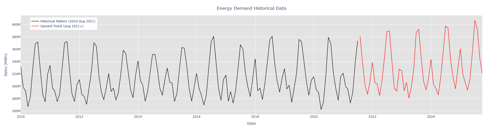

# Energy Sales Forecasting Project

## Executive Summary

Energy sales remained relatively stable from 2010-2019, fluctuating around a modest upward trend. However, starting in early 2020, sales began increasing significantly, creating uncertainty about whether this represents a permanent shift or temporary spike. To address this uncertainty, two forecasting scenarios were developed:

- **Growth Model**: Assumes the recent upward trend continues, helping plan for higher demand scenarios (95.4% accuracy)
- **Conservative Model**: Assumes reversion to the historical stable pattern, supporting cautious resource planning (97.2% accuracy)

Both models capture seasonal patterns effectively, with residual analysis confirming well-fitted forecasts. This dual-scenario approach enables decision-makers to evaluate risk and plan for multiple possible futures. Accuracy calculated as 100 - MAPE, meaning forecasts of the growth and conservative models are within 4.6% and 2.8% of actual values on average respectively.

> 📊 **View the full analysis:** [Python notebook](Energy_Sales_Forecast.ipynb)

> 📊 **View interactive dashboard:** [Streamlit App](https://energy-sales-forecast.streamlit.app/)

---

## Project Background

This project analyzes historical energy sales data (in megawatt-hours) from the **U.S. Energy Information Administration (EIA)** to forecast future energy demand. Accurate energy demand forecasting supports better planning, grid management, and resource allocation. By modeling trends and seasonality in historical consumption, this project demonstrates practical applications of time series analysis for energy markets.

## Objective

The primary objective of this project is to analyze historical energy sales and forecast future demand. Specifically, the project focuses on:  
- Identifying trends and seasonal patterns in historical energy sales  
- Building a forecasting model with reliable predictive performance

## Dataset Overview

The dataset contains historical energy sales (in MWh) from the EIA, with the following key variables:  
- **date** – timestamp of the observation  
- **sales** – total energy sold (megawatt-hours)  

---

## Key Insights

### Historical Trends

### Model Performance
Both SARIMA models achieved 97.5% accuracy (100 - MAPE), with residual analysis confirming minimal autocorrelation and well-fitted forecasts.

[Add: Visual comparison of model forecasts vs actuals, residual plots if available]

---

## Methods

The analysis leveraged **SARIMA modeling** to capture both trend and seasonal patterns:

**Exploratory Data Analysis (EDA):**  
Visualized historical energy sales to detect seasonality, trend components, and anomalies. Decomposition helped determine SARIMA parameters.  

**Final Model Selection:**  
Based on the results of the exploratory data analysis (EDA) and the insights gained from applying the Auto ARIMA function, two SARIMA models were developed to capture different forecasting scenarios:

- **Model 1 – Conservative:**  
  - Prioritizes steady trends in the data  
  - Produces cautious forecasts, minimizing overestimation of future growth  

- **Model 2 – Growth:**  
  - Emphasizes the upward trend observed in the last 4 years  
  - Produces higher forecasts, capturing potential growth opportunities  
---

## Recommendations

- **Short-Term Operational Planning**: For near-term decisions such as generation scheduling, fuel procurement, and load balancing, the growth model is recommended. Its sensitivity to recent trends makes it better suited for responding to emerging demand shifts, seasonal changes, or recent market dynamics. Using this model can help reduce the risk of underestimating demand, which may lead to costly shortages or reliance on spot-market energy purchases.

- **Long-Term Strategic Planning**: For medium- to long-term planning, including infrastructure investment, capacity expansion, and budgeting, the conservative model is more appropriate. Its reliance on historically stable patterns reduces the likelihood of overreacting to temporary spikes or anomalies in demand. This approach supports more stable capital allocation decisions and helps mitigate the risk of overinvestment based on short-lived growth.

- **Risk Management and Scenario Planning**: Decision-makers should consider using both models jointly to define a realistic planning range. The conservative model can serve as a lower bound and the growth model can serve as an upper boundThe conservative Planning within this range allows for better risk management by preparing for higher-demand outcomes without fully committing resources based on optimistic assumptions alone.

- **Ongoing Monitoring**: Regularly updating and evaluating forecast performance is recommended, particularly as new data become available. If sustained growth continues to be observed, greater reliance on the growth model may be warranted over time. Conversely, if demand stabilizes or declines, the conservative model should be prioritized.

